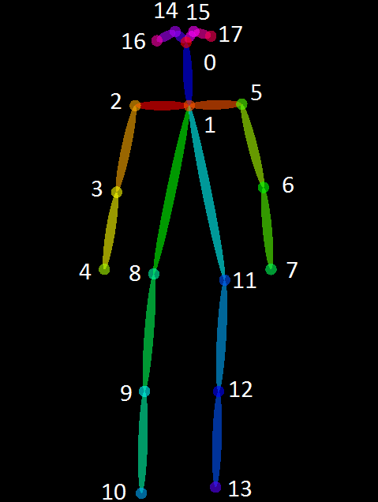

## OpenPose model implementation

#### Description:

This notebook is largely based on the model implementation of _OpenPose_(C) by Kunal Bhashkar (<bhashkar.brand@gmail.com>) available at: https://github.com/kunalBhashkar/OpenPose-Pose-Estimation. _OpenPose_ is the first open-source realtime system for multi-person 2D pose detection, including body, foot, hand, and facial keypoints, by Cao et al. (2018). The multi-stage CNN neural network architecture first encodes human body part-to-part association, then compute confidence maps. Its input are the feature maps of images obtained from the first 10 layers of VGG-19 fine-tuned.

#### Reference:
See: Zhe Cao, Gines Hidalgo, Tomas Simon, Shih-En Wei, Yaser Sheikh, "[Computer Vision and Pattern Recognition](https://arxiv.org/abs/1812.08008)," arXiv:1812.08008 [cs.CV] (Dec. 2018).

#### Computing environment requirements and dependencies:
Software requirements: Beside the _Openpose_ model, this notebook was successfully built in a Python 3.7.0 virtual environment based on custon iPython kernel, and on the following  packages: 

- Tensorflow
- Pytorch
- OpenCV

#### Hardware compatibility:

- CUDA (Nvidia GPU)
- OpenCL (AMD GPU)
- non-GPU (CPU-only)

#### Usage:
- Command-line demo for built-in functionality.
- C++ API and Python API for custom functionality. E.g., adding your custom inputs, pre-processing, post-posprocessing, and output steps.

To run the notebook code, first consolidate the 5 Models/Coco/*.caffemodel_split0{0,1,2,3,4} files and 2 Models/yoga-asana-classifier.ckpt_split0{0,1} files, issuing the following cmd in terminal from the same directory level where the split file chunks are located:

    $ cat *.caffemodel_split0{0,1,2,3,4} >| pose_iter_440000.caffemodel
    $ cat yoga-asana-classifier.ckpt_split0[0,1] >| yoga-asana-classifier.ckpt

For further details, check the [major released features](https://github.com/CMU-Perceptual-Computing-Lab/openpose/blob/master/doc/07_major_released_features.md) and [release notes](https://github.com/CMU-Perceptual-Computing-Lab/openpose/blob/master/doc/08_release_notes.md) docs.

#### COCO pose estimation model output format:

### Copyright and licensing information
OpenPose is freely available for free non-commercial use, and may be redistributed under the conditions described in the licensing terms as represented in the accompanyig file **License.md** in this repo.
